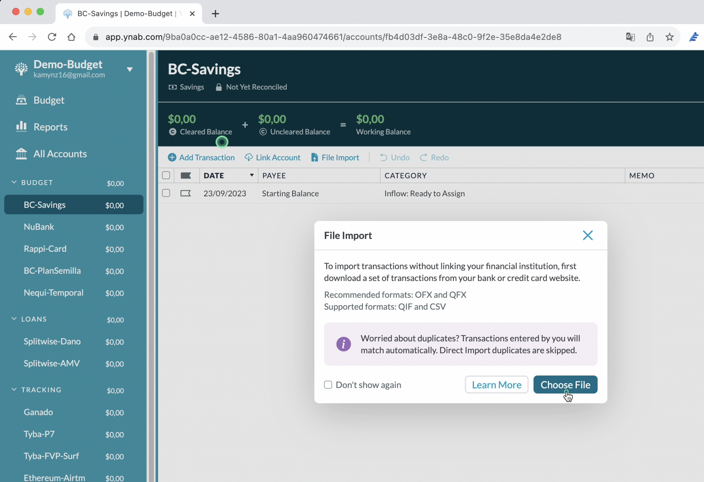

# BudgetYNABProgram Project
> This FastAPI app allows you to change the structure of transaction .txt file from Colombian Bank to accepted structure of YNAB App. 

## Description

This repository showcases my abilities and projects in [Python, FastApi and Docker]

## Table of Contents

1. [Installation](#installation)
2. [Usage](#usage)
3. [Features](#features)
4. [Project List](#project-list)
5. [Contributing](#contributing)
6. [License](#license)
7. [Contact](#contact)

## Demo Gif

## Features

[List the key features of your projects]

## Usage

[Provide instructions on how to use and run the projects]

## Installation

[Describe how to install and set up your projects, including any prerequisites or dependencies]

## Components List

1. **[Bank Data to YNAB-File-Import]**
   - Description: [Briefly describe what the project does and its purpose]
   - Repository: [Link to the Github repository]

2. **[Predict Transaction Reference]**
   - Description: [Briefly describe what the project does and its purpose]
   - Repository: [Link to the Github repository]

## Contributing

I welcome contributions to my projects! If you find any issues or have ideas for improvements, feel free to open an issue or submit a pull request. Please ensure to follow the [contributing guidelines](CONTRIBUTING.md) before making any contributions.

## License

This project is licensed under the [License Name] License - see the [LICENSE](LICENSE) file for details.

## Contact

If you have any questions or want to reach out to me, you can contact me at [your.email@example.com]. I'm always open to discussions and collaborations!

---

Thank you for visiting my Github project. I hope you find my work interesting and valuable. Don't forget to leave a star if you like what you see! Happy coding! 😄

This project has adopted the [Microsoft Open Source Code of Conduct](https://opensource.microsoft.com/codeofconduct/).

For more information see the [Code of Conduct FAQ](https://opensource.microsoft.com/codeofconduct/faq/) or
contact [opencode@microsoft.com](mailto:opencode@microsoft.com) with any additional questions or comments.

